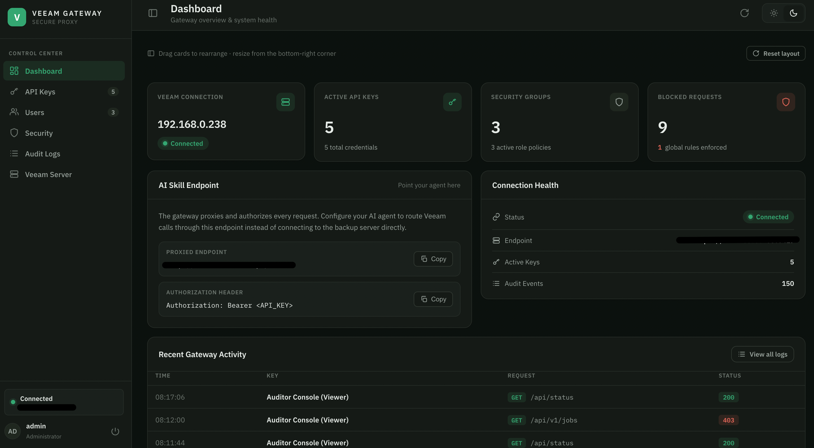

# Veeam v13 Secure Gateway & AI Skill Integration

This repository contains a complete solution to securely integrate an AI Assistant (like Gemini) with a Veeam Backup & Replication v13 environment.

*The Enterprise Console dashboard — gateway health, security groups, blocked requests, and recent activity at a glance.*

## Repository Structure

- **`gateway/`**: The secure proxy gateway deployed on the Atelier platform (or runnable locally with Docker/Podman). It manages credentials, token caching, global blocklist rules, Role-Based Access Control (RBAC), and logs audit events to an SQLite database. 
  - *See [gateway/README.md](gateway/README.md) for local container running instructions.*
- **`skills/veeam-v13/`**: The custom AI skill directory that equips the agent with instructions and a local schema search tool (`veeam_search.py` + `swagger.json`) to find and call Veeam endpoints securely.
  - *See [skills/veeam-v13/SKILL.md](skills/veeam-v13/SKILL.md) for agent usage guides.*
- **`spec.md`**: A stack-agnostic **build specification** — the interface contract and security invariants of the gateway and skill — for anyone who wants to build their own version of the tool instead of running the pre-baked reference implementation.
  - *See [spec.md](spec.md) to reimplement in your own stack.*

## Setup Instructions

See the README files in the respective directories for detailed configuration and deployment guides.

## License

Released under the [MIT License](LICENSE).
